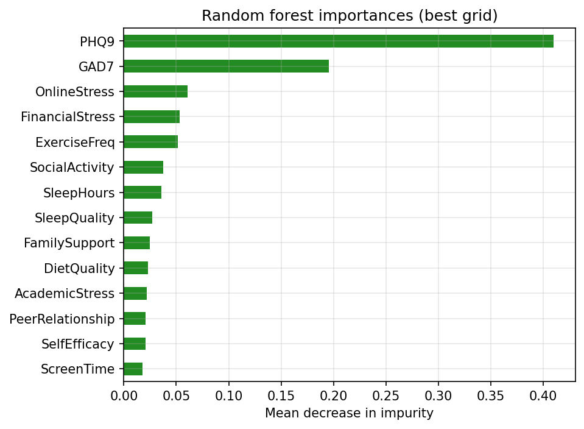
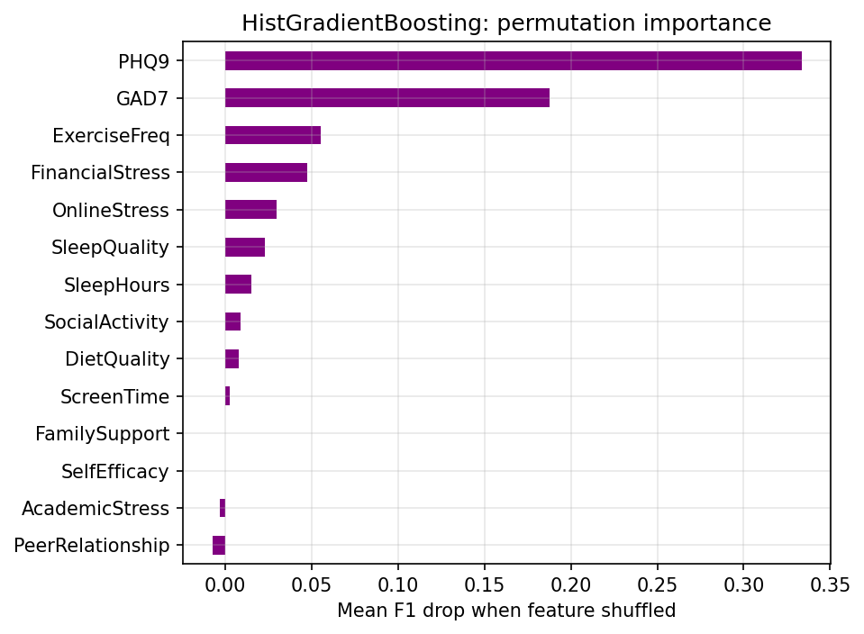

# Capstone Project - University Student Mental Health Indicators

**Roopa Balakrishnan(Ramaswamy)**

# Executive summary

This project uses the [University Student Mental Health Indicators](https://www.kaggle.com/datasets/yuanchunhong/university-student-mental-health-indicators) dataset (~1,800 students) to predict **at-risk mental health status** from survey-style features. Exploratory analysis showed that **clinical scales (PHQ9, GAD7)** drive most of the separability between groups; **GPA** was dropped before modeling because it **did not separate** the outcome classes.

The [Modeling.ipynb](Modeling.ipynb) notebook compares **five** classifiers under the same **stratified train/test split** and **`GridSearchCV` with `scoring='f1'`** for the **at-risk** class: **decision tree**, **SVC**, **KNN**, **random forest**, and **histogram-based gradient boosting** (`HistGradientBoostingClassifier` with **`class_weight='balanced'`**). **Linear SVC**, **random forest**, and **boosting** typically compete for the best **F1**; **KNN** is weaker on this feature set. **Figures** in the notebook summarize **CV vs test F1**, **train/predict times**, **confusion matrices** for the **top two** test-F1 models, and **feature importances** for **forest vs boosting**.

**Takeaway:** **PHQ9/GAD7**-driven signal supports **moderate F1** on held-out data, but **perfect screening** is not realistic from this table alone; deployment would need **threshold tuning**, **validation on new cohorts**, and **human oversight**. It is **difficult to push precision and recall up together** to very high levels: the sample is **finite (~1,800)**, the **at-risk group is a minority**, many survey fields **overlap a lot** between classes, and the label reflects a **complex outcome** that these columns only partly capture—so models tend to hit a **performance ceiling**, and improving **recall** (catching more true at-risk students) usually **lowers precision** (more false alarms), or the reverse, unless **new or richer data** are added.

# Rationale
Institutional resources for student support are often limited and reactive. By identifying the most impactful predictors of distress, universities and high schools can shift toward proactive intervention. This allows for the design of targeted support programs that address the root causes of stress—whether they be academic, financial, or social—before they escalate into severe mental health crises.

# Research Question
Can we accurately predict the risk of significant student mental health distress by modeling the interplay between academic performance, socioeconomic proxies, and lifestyle factors?

# Data Sources
Structured student dataset, such as "University Student Mental Health Indicators Dataset" available on [Kaggle](https://www.kaggle.com/datasets/yuanchunhong/university-student-mental-health-indicators), which provides validated stress indices alongside demographic and academic variables.

# Methodology
To address both the prediction and inference goals of this study, I will apply the following methods:

- Preprocessing & Feature Engineering: Creating composite "Pressure Indices" and applying StandardScaler to ensure coefficients are comparable across different scales.

- Logistic Regression: To establish a baseline for prediction and use its coefficients to understand the linear relationship between factors like financial stress and mental health risk. <code style="color : red">(*look at methodology changes*)</code>

- Decision Tree Classifier: To capture non-linear relationships and create an interpretable "risk flowchart." This will help identify specific thresholds (e.g., a critical drop-off in health when sleep falls below 5 hours).  Although the dataset I have chosen has 1800 rows - and could be considered limiting for decision trees.

- Support Vector Classifier (SVC): To find the optimal hyperplane that separates "At Risk" from "Not At Risk" students, particularly if the relationships in the data are high-dimensional or complex.

- K-Nearest Neighbors (KNN): To classify students based on their similarity to "profiles" of previous students.

- Random Forest: To combine many de-correlated trees for stronger nonlinear patterns than a single decision tree, with **`class_weight='balanced'`** and **feature importances** for interpretation.

- Histogram Gradient Boosting: **`HistGradientBoostingClassifier`** with **`class_weight='balanced'`** as a strong **tabular** ensemble; compared under the same **F1**-based grid search.

- Reporting (see [Modeling.ipynb](Modeling.ipynb)): **Train/predict wall times**, **metric and timing plots**, **confusion matrices** for the **two best** test-F1 fits, and **importance** plots for **random forest vs boosting**.

# Results

## Exploratory Data Analysis (EDA) Findings ([Notebook link](https://github.com/rooparb-cyber/MLPortfolio/blob/main/Capstone%20Project/EDAAndBaseLine.ipynb) )
The EDA identified that the dataset’s strength lies in its psychological indicators rather than its academic or demographic variables.

- Feature Variance: PCA results showed a flat variance profile, showing that no single linear combination of features dominates the dataset.

- Correlation Analysis: The correlation matrix revealed near-zero coefficients between features (e.g., PHQ9 and GAD7 had a correlation of only -0.016), indicating high feature independence.

- Predictive Signals: KDE plots demonstrated significant class separation for PHQ9 and GAD7, making them the primary candidates for the baseline model.

- Feature Pruning: GPA was removed from the feature set prior to modeling due to its perfect distributional overlap between classes, which would have introduced unnecessary noise.

### Methodology Changes 
I had originally planned for Logistic Regression for baseline modeling, but have moved in favor of Decision tree to better handle the non-linear thresholds found in the KDE plots

### Baseline Model Performance
A Decision Tree Classifier was utilized to establish a performance benchmark, specifically chosen for its ability to handle non-linear thresholds and class imbalance.

### Choice of Evaluation Metric: F1-Score vs. Accuracy
* While Accuracy is a common metric, it can be highly misleading when working with imbalanced datasets like this one. In a dataset where 90% of students are "Not at Risk," a model could achieve 90% accuracy by simply predicting "Not at Risk" for everyone—completely failing to identify the 10% of students who actually need help.

* Balancing Precision and Recall: The F1-score is the harmonic mean of Precision and Recall, making it a much more robust measure for this research question.

> | Model | F1-Score | Note |
> |---|---|---|
> | Dummy Classifier | 0.3700 | Stratified baseline representing random chance|
> | Decision Tree (Baseline) | 0.5929 | Higher performing baseline using class_weight='balanced'.  There is substantial "heavy lifting" left. |

### Feature Importance Analysis
The chart in the *Feature importance graphing* cell provides a mathematical ranking of how much each variable contributed to the Decision Tree’s 0.5929 F1-score:

- Dominant Predictors: PHQ9 and GAD7 are the clear leaders, validating the KDE plot findings that these clinical scales offer the strongest class separation.

- Secondary Signals: ExerciseFreq and FinancialStress hold mid-tier importance. While they didn't show massive shifts in EDA, the model found specific thresholds within these variables to refine its predictions.

- Noise Reduction: Features like SocialActivity and SleepHours appear at the bottom. This supports the earlier intuition that many lifestyle factors in this dataset provide very subtle, perhaps even negligible, predictive value on their own.

- Successful Pruning: By having already removed GPA (which showed zero separation), we have ensured the model didn't waste its limited "splitting power" on a feature that would have ranked at the very bottom or confused the baseline.

### Comparative modeling ([Modeling.ipynb](Modeling.ipynb))

Five models are tuned with **GridSearchCV** and **F1 (at-risk positive)** on the same **80/20 stratified** split. **SVC** (often **linear** after search), **random forest**, and **HistGradientBoosting** are usually the **top tier** on F1; **KNN** often **trails** those three. The notebook’s **plots** compare **CV vs test F1**, **wall-clock** grid-search **training** and **test prediction** times, **confusion matrices** for the **two strongest** models on test F1, and **feature importances** for **forest** and **boosting**—both typically emphasize **PHQ9** and **GAD7**, consistent with EDA.

#### Feature importance figures (saved from [Modeling.ipynb](Modeling.ipynb))

Running the **Visualizations** code cell writes PNGs to the [`figures/`](figures/) folder. For a direct file link, the side-by-side panel is [`feature_importances_rf_and_histgb.png`](figures/feature_importances_rf_and_histgb.png).

**Random forest** (mean decrease in impurity, best grid):

**HistGradientBoosting** (permutation importance on the test set, `scoring='f1'`):

#### Next steps

- **Talk with counselors or student-life staff** about what kinds of mistakes matter most (missing someone who needs help vs. flagging someone who is fine). That judgment should drive how you read the confusion matrix, not just a single accuracy number.
- **Gather or link more rows** (another term, another campus, or a follow-up survey) and see whether the same models still perform well—if rankings collapse, the current results may be specific to this slice of data.
- **Pilot with humans in the loop:** treat the model as a *suggestion* list for staff review, not an automatic label, until we have real-world feedback.
- **Stress-test simple “what if” questions:** e.g. drop one feature group (lifestyle-only vs. clinical scales) and re-run to see whether conclusions about “what matters” stay stable.
- **Re-run the notebook** with a different random split (change the seed) once or twice; and observe if the best model keeps changing.

#### Outline of project

- [EDA And BaseLine model notebook](https://github.com/rooparb-cyber/MLPortfolio/blob/main/Capstone%20Project/EDAAndBaseLine.ipynb)
- [Modeling: tuned classifiers, timings, visualizations](https://github.com/rooparb-cyber/MLPortfolio/blob/main/Capstone%20Project/Modeling.ipynb)
- [Link to notebook 3]()

##### Contact and Further Information